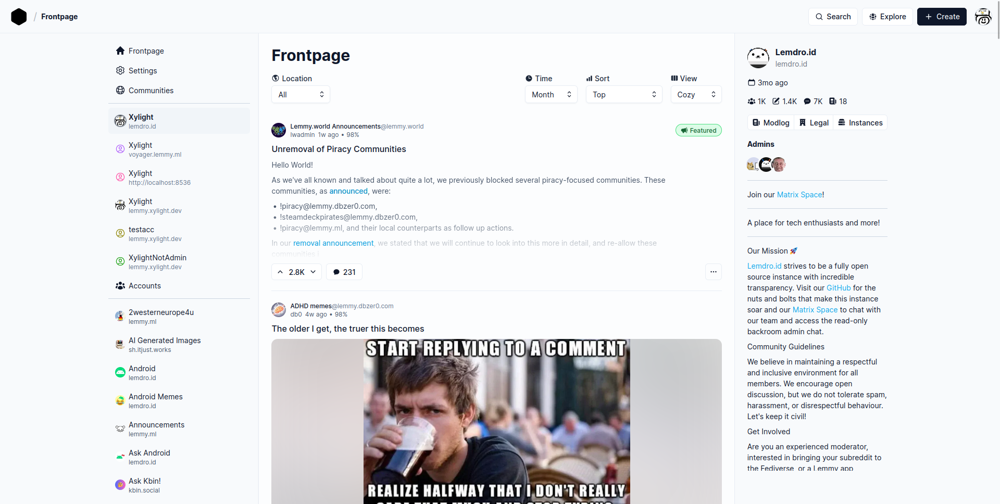

# Photon CI/CD pipeline

Deploy Photon server with CI/CD on Elestio

 
 

# Once deployed ...

You can open Photon ADMIN UI here:

    URL: https://[CI_CD_DOMAIN]
    
# Configure Own Instance

By default, we set it up to display the `lemmy.ml` instance in the UI. However, if you prefer to use your Lemmy service, please follow the instructions below.

### Dedicated Service:
1. Open the Elestio dashboard
2. Go to the Service overview
3. Click on the `Update Config` button.
4. Select the `Env`.
5. Edit `PUBLIC_INSTANCE_URL` with your real domain.
6. Click `Update & Restart` to reflect the changes.

#### CI/CD:
1. Open the Elestio dashboard
2. Go to the Pipeline Overview
3. Go to the `Build & Deploy` tab.
4. Click on the `Environment Variables` tab.
5. Edit `PUBLIC_INSTANCE_URL` with your real domain.
7. Click the button `Apply Changes` to reflect the changes.
